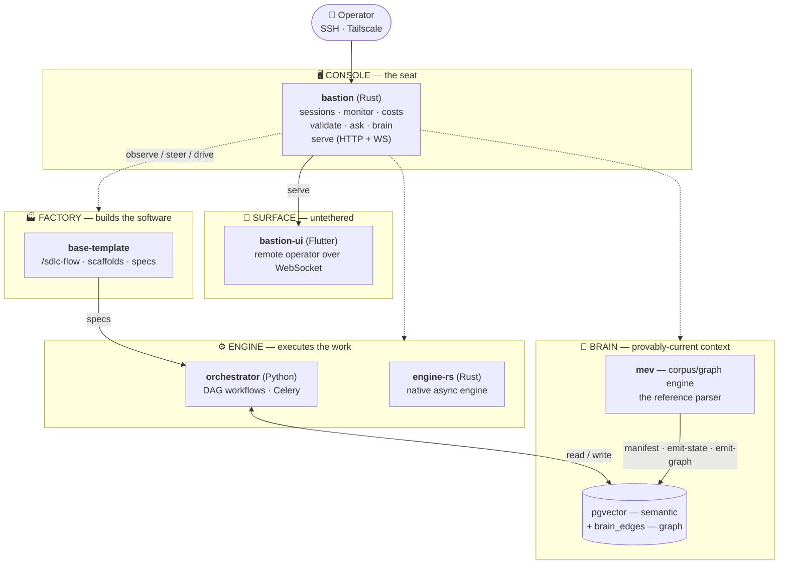

# Bastion

### An AI-Native Company Brain & Agentic Operating System

**This isn't a wrapper around an LLM.** It's a five-layer operating system for running many
autonomous agents from a single seat — a strict SDLC **factory** that builds software, an
**engine** that executes agent workflows, a semantic-graph **brain** that stays provably current,
and a real-time **console** (plus a phone) to observe, steer, and kill it all.

Built solo, in the open, as the operations substrate for a one-person engineering practice.

---

Bastion is not one repository. It's an **ecosystem** of independently-versioned repos — each with
its own git history, test suite, and release cadence — that compose into a single coherent system.
This repo is the **front door**: the map, the architecture, and the links out. There is no
application code here.

## System architecture

Five layers, one operator. The **Console** is the seat; everything else answers to it.

### The load-bearing seams

The system's integrity lives in a small number of one-way contracts — not in any single repo:

- **Console → Engine.** `bastion` acts *through* the Engine's API, never around it. The
  cost → budget → kill loop is the first thing written across this seam.
- **Console ↔ Surface.** `bastion serve` exposes a versioned HTTP + WebSocket API; `bastion-ui`
  pins it. The operator leaves the desk without leaving the system.
- **`mev` → everything.** `mev` is the *only* writer of derived state and graph views
  (`manifest`, `emit-state`, `emit-graph`). One parser for the company's file formats — no
  hand-maintained view is allowed to drift from source.
- **Brain → Engine.** What is *validated* is what is *embedded*: the Engine indexes exactly the
  corpus `mev` blesses, and graph edges enter retrieval as first-class signal.
- **Factory → all repos.** `base-template` is the single source of the SDLC harness; it
  distributes commands and hooks downstream to every repo it scaffolded.

The guiding principle: **stop building new rooms; wire the rooms that exist.** A solo-run system
fails not from missing features but from *self-knowledge drift* — lagging views, duplicate parsers,
an index that's never current. Bastion is architected against that failure mode first.

## The modules

Each links to its own standalone repository.

### Primary subsystems

| Repo | Layer | What it is |
|---|---|---|
| [`bastion`](https://github.com/bredmond1019/bastion) | Console | The Rust mission-control terminal — sessions, live cost/budget, validation, brain Q&A, and the `serve` API. |
| [`orchestrator`](https://github.com/bredmond1019/orchestrator) | Engine | A Python workflow engine — DAG-validated execution, Celery workers, deterministic state machines, LLM triage routing. |
| [`engine-rs`](https://github.com/bredmond1019/engine-rs) | Engine | The native Rust execution engine (greenfield) — async runtime with durable state persistence. Published as explicit WIP. |
| [`mev`](https://github.com/bredmond1019/mev) | Brain | The corpus/graph engine — the *reference parser* for the company graph: resolves edges, maintains the corpus, feeds the semantic store. |
| [`base-template`](https://github.com/bredmond1019/agentic-base-template) | Factory | The software factory — the `/sdlc-flow` pipeline, spec scaffolds, and isolated git worktrees. Birthplace of every block. |
| [`bastion-ui`](https://github.com/bredmond1019/bastion-ui) | Surface | The untethered mobile operator — a Flutter app (Riverpod, real-time WebSocket) that drives `bastion serve` from a phone. |

### Supporting libraries

| Repo | Role |
|---|---|
| [`okf-core`](https://github.com/bredmond1019/okf-core) | The single-source contract crate — the OKF frontmatter schema, graph edges, and state model shared by `bastion` and `mev`. One definition, no divergence. |
| [`bella`](https://github.com/bredmond1019/bella) | The Console-family TUI framework — a terminal markdown viewer/editor (Rust). Absorbing into `bastion`. |
| [`claude-code-rs`](https://github.com/bredmond1019/claude-code-rs) | A tightly-scoped defensive library wrapping the Claude Code CLI — handles OS traps (orphaned processes) and forward-compatible deserialization. |
| [`rag-engine-rs`](https://github.com/bredmond1019/rag-engine-rs) | The early-era Rust RAG backend — hybrid retrieval, pgvector, bare-metal Actix WebSocket streaming. The "cut-my-teeth on concurrency" piece. |

## How the ecosystem operates

A day in the life of the system:

1. **Plan.** An idea is scaffolded into a spec via `base-template` — a strict SDLC block with
   acceptance criteria and a test strategy.
2. **Execute.** The `orchestrator` runs the SDLC tasks, fanning work into isolated git worktrees
   and driving Claude through native, defensive tooling.
3. **Observe.** The operator watches sessions, real costs, and progress in real time from
   `bastion` — at the desk, or from a phone via `bastion-ui`.
4. **Integrate.** On completion, `mev` recomputes the company graph and the new knowledge is
   embedded into the Brain — so what the system *knows* about itself is never stale.

## A note on structure

These repos are **decoupled by design** — isolated git histories, independent SDLC loops, separate
release cadences. Cross-repo coupling is deliberate and minimal (path-dependencies and versioned
API seams, not a shared monorepo). This front door is a *hub*, not a checkout: clone the individual
repos you want to read. The Rust console repos (`bastion`, `mev`) build within the Bastion workspace
against their sibling crates — see each repo's README for build notes.

---

*Built by [Brandon Redmond](https://github.com/bredmond1019). Bastion is the system;
[Bastiel](https://bastiel.com.br) is the practice it runs.*

## License

Licensed under either of

- Apache License, Version 2.0 ([LICENSE-APACHE](./LICENSE-APACHE) · <http://www.apache.org/licenses/LICENSE-2.0>)
- MIT license ([LICENSE-MIT](./LICENSE-MIT) · <http://opensource.org/licenses/MIT>)

at your option. Unless you explicitly state otherwise, any contribution intentionally submitted
for inclusion in this work by you, as defined in the Apache-2.0 license, shall be dual licensed
as above, without any additional terms or conditions.

Built for one operator and released because it may be useful to others — there is no support
obligation, no issue-response SLA, and no stability promise. See HQ decisions D40 and D75.
